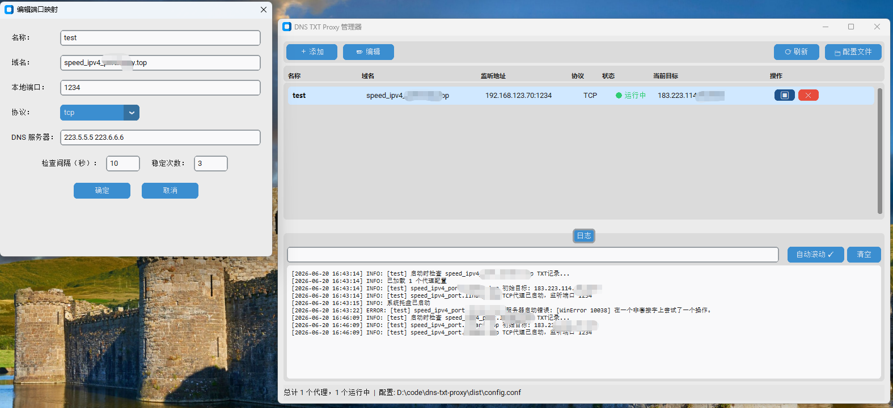
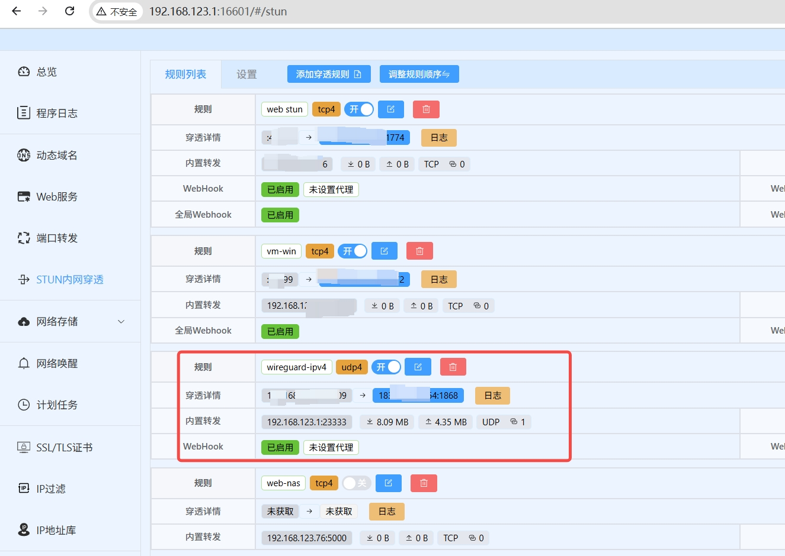
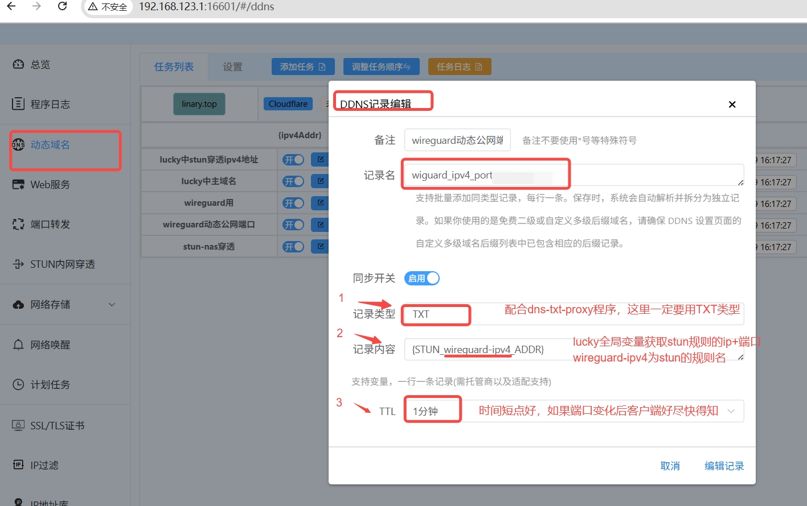

# 动态域名端口代理程序 (dns-txt-proxy.py)

## 📌 简介
`dns-txt-proxy.py` 是一个 **动态端口代理程序**，可通过解析 **DNS TXT 记录** 获取目标服务器的 **动态IP:动态端口** 并自动更新，实现 TCP/UDP 端口转发, 变向实现固定IP:端口的目的。
- 用于没有固定公网IPV4的环境，也可用于没有公网IP但可通过lucky内网穿透的公网IP
- 支持 **多实例配置文件模式** 和 **命令行单实例模式**
- 支持 DNS 记录变化自动切换目标
- 适合用于 NAT 穿透、动态端口代理等场景 ，如wireguard、openvpn客户端口连接服务端的ip与端口变向固定
- 注意： 这是一个客户端软件，【是在 需要异地访问lucky公网ip：端口 的地方部署使用】
---

## 🚀 使用方式

### 1. 命令行单实例模式
python版本：3

安装依赖： pip install -r requirements.txt

直接指定域名和本地监听端口：
```bash
python dns-txt-proxy.py --domain example.com --local-port 9000 --protocol tcp --interval 5 --stability 1 --dns-servers 8.8.8.8 8.8.4.4
```
参数说明：
| 参数 | 说明 | 默认值 |
|------|------|--------|
| `--domain` | 要解析的域名（TXT 记录应为 `IP:端口` 格式） | 必填 |
| `--local-port` | 本地监听端口 | 必填 |
| `--protocol` | 协议类型（`tcp` 或 `udp`） | `tcp` |
| `--interval` | 检查 TXT 记录的间隔（秒） | `10` |
| `--stability` | 稳定性判断次数（连续相同解析结果的次数才更新） | `3` |
| `--dns-servers` | 自定义 DNS 服务器（空格分隔多个） | Google DNS |
| `--log-file` | 指定生成日志文件到此位置 | 非必填 |

<font color="red">如何访问服务：
  直接本地访问localhost:9000 ，则可访问到 example.com记录的ip:端口所代理的服务
</font>
---

### 2. 配置文件多实例模式
如果不传 `--domain` 参数，则自动读取配置文件（默认 `config.conf`），可同时启动多个代理实例。

> `config.conf` 已加入 `.gitignore`，不会提交到仓库。
> 首次使用可复制 `config.conf.example` 为 `config.conf` 并修改其中的域名。

配置文件示例（详见 `config.conf.example`）：
```ini
[global]
# 日志文件路径（可选，留空则只输出到终端）
#log_file = d:\dns-txt-proxy.log

[proxy1]
domain = txt1.example.com
local_port = 9001
protocol = tcp
interval = 10
stability = 3
dns_servers = 223.5.5.5 223.6.6.6

[proxy2]
domain = txt2.example.com
local_port = 9002
protocol = udp
interval = 5
stability = 2
dns_servers = 223.5.5.5 223.6.6.6
```
启动：
```bash
python dns-txt-proxy.py
```
或指定配置文件路径：
```bash
python dns-txt-proxy.py --config /path/to/config.conf
```

---

### 3. docker方式启动（可多实例方式）
启动：
```bash
docker-compose -f docker-compose.dns-txt-proxy.yml up -d
```

配置文件示例：
同上

查看日志：
```bash
docker logs -f dns-txt-proxy
```


---


### 4. Windows 启动
下载 `DNS-TXT-Proxy-Manager.exe` 直接运行（无需 Python 环境），即系统托盘后台运行。
支持图形化管理：添加/编辑/删除端口映射、启动/停止代理、实时查看日志。
可右键托盘图标设置「开机自启」。



打包命令（需 Python + PyInstaller）：
```bash
python windows\build_exe.py
```

### 5. 其他的方式启动
[各环境把脚本注册为系统服务](各环境把脚本注册为系统服务.md)


## 📄 TXT 记录格式
TXT 记录内容必须为：
```
IP:端口
```
例如：
```
203.0.113.10:5000
```
注：
#### 
- 1、对于没有公网IP的环境，可使用lucky的stun内网穿透服务，获取到对应服务的公网IP：端口,
     然后再用lucky的动态域名，把域名解析TXT记录
- 2、对于有动态公网IP，直接使用lucky的域名解析，记录TXT记录 IP:端口
- 3、 (可选参考) lucky的stun穿透办法 ：https://lucky666.cn/docs/modules/stun
- 4、安装好lucky，比如这样获取公网ip并解析至dns上


---

## ⏱ 切换延迟说明
切换到新 IP:端口的时间取决于：
```
延迟 ≈ DNS TTL + interval × stability
```
- 建议将 DNS TTL 设为 30 秒或更短，以便快速更新
- 如果需要秒级切换，可设置：
  ```
  interval=5
  stability=1
  ```
  并使用权威 DNS 服务器直连

---

## ⌨️ 停止程序
在运行窗口按：
```
Ctrl + C
```
即可停止所有代理实例。


## ⌨️ 使用场景
- 运营商不给公网IPV4时，使用lucky的stun内网穿透、动态域名 代理wireguard服务端，再用此程序 实现在windows上固定端口连接wireguard服务端
- 同上也可代理web服务
- 修改一下脚本，用于openwrt中连接wireguard服务端等
- Windows 下推荐使用图形界面管理工具（系统托盘后台运行，支持开机自启）：
  ```bash
  windows\build_exe.py                    # 打包成单 exe
  dist\DNS-TXT-Proxy-Manager.exe          # 运行 GUI 管理器
  ```
  也可继续使用命令行模式打包成独立 exe：
  ```bash
  pip install pyinstaller
  pyinstaller --onefile dns-txt-proxy.py
  ```
  （图形界面运行在系统托盘，关闭窗口不退出；命令行模式关闭窗口即断开）
